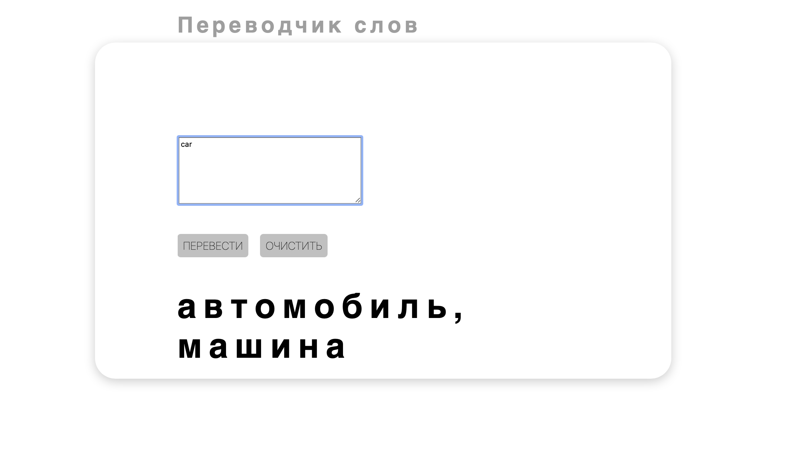

# REST API
### Проект
В этом проекте мы будем взаимодействовать с внешними сервисами. Нужно сделать следующее:
1. Командой выберите любой бесплатный API в сети. Примеры по [ссылке](https://habr.com/ru/company/macloud/blog/562700). 
Требование одно: чтобы API вам нравился, и вам было интересно с ним работать. 
2. Напишите класс взаимодействия с API, а в рамках класса методы взаимодействия с ним.
Пример реализации на основе [API Numbers](http://numbersapi.com/) можно посмотреть [тут](code-samples/numbers.py). 
Чем сложнее функционал, тем круче результат. Вы никак не ограничены в своей фантазии :)
3. После реализации и проверки функциональности напишите небольшой сервис на Flask, FastAPI, или телеграм-бота.
Нужно, чтобы каждый мог пользоваться функциональностью, которую вы заложили в свой сервис.
4. Запустите ваш сервис на любом бесплатном веб-хостинге (например, Heroku).

***<b>
